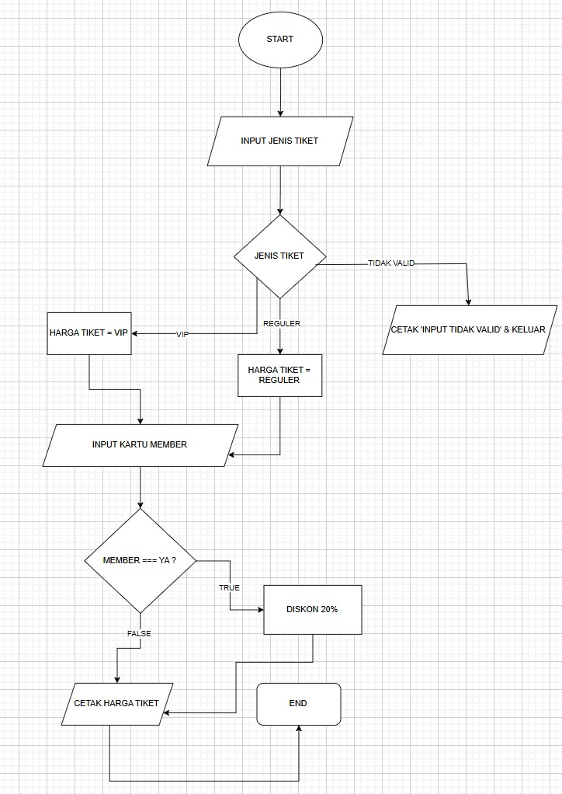
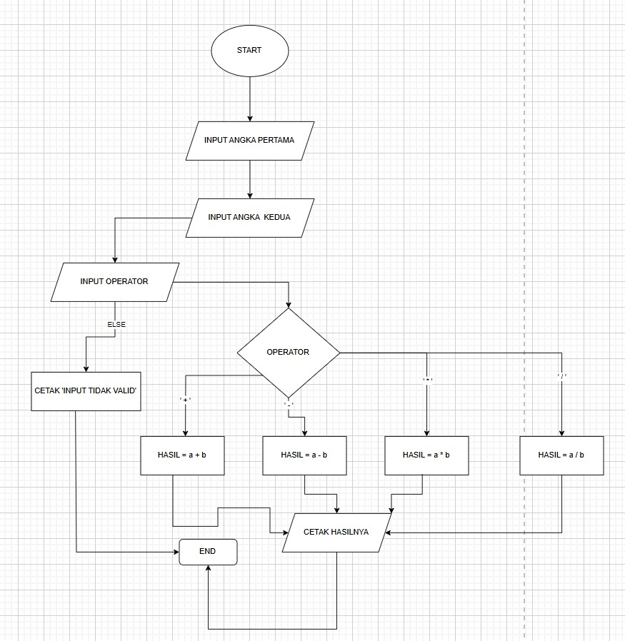

# lapy02

# Program Harga Tiket
  # Codingan
  ```python 
reguler = 50000
vip = 100000
discount = 0.2

tipe_tiket = input('tipe tiket(reguler/vip :)' )
status_member = input('apakah mempunyai member(iya/tidak :)')

if tipe_tiket == 'reguler':
    harga_tiket = reguler
elif tipe_tiket == 'vip':
    harga_tiket = vip 
else : 
    print('tiket tidal valid')
    exit()
    
if status_member == 'iya':
    harga_tiket = harga_tiket - (harga_tiket * discount)

print(f'total harga yang harus di bayar {harga_tiket}')
```
Penjelasan codingan di atas adalah dimana ada 2 buah tiket yang satu "reguler" kemudian yang ke dua "vip" dan ada discount bagi yang berlangganan sebesar 20%. setiap tiket memiliki harga yang berbeda yang dimana untuk harga teket sebagai berikut, 
```
tiket reguler : 50.000
tiiket vip : 100.000
```

Untuk setiap pembelian akan di kenakan discount member sebesar 20% tetapi jika tidak memiliki member maka harga yang harus di bayar adalah harga yang tertera di atas. jika membeli tiket dan memiliki member discount sebagai berikut,
```
tiket reguler : 50.000 * 20%
              : 40.00
tiket vip     : 100.000 * 20%
              : 80.000
```

# Output Program 
```
tipe tiket(reguler/vip):reguler
apakah mempunyai member(iya/tidak):tidak
total harga yang harus di bayar 50000

tipe tiket(reguler/vip):reguler
apakah mempunyai member(iya/tidak):iya
total harga yang harus di bayar 40000.0

tipe tiket(reguler/vip):vip
apakah mempunyai member(iya/tidak):tidak
total harga yang harus di bayar 100000

tipe tiket(reguler/vip):vip
apakah mempunyai member(iya/tidak):iya
total harga yang harus di bayar 80000.0
```

# Flowchart
 

# Program Kalkulator
  # Codingan 
```
def kalkulator ( angka1, angka2, operator ):
    if operator == '+' :
        return angka1 + angka2
    elif operator == '-':
        return angka1 - angka2
    elif operator == '*':
        return angka1 * angka2
    elif operator == '/':
        return angka1 / angka2
  
angka1 = int(input('masukan angka1 :'))
angka2 =  int(input('masukan angka2 :'))
operator = input("pilih operator (+, -, *, /): ")


int(kalkulator (angka1, angka2, operator))
print(f'hasilnya adalah :', kalkulator (angka1, angka2, operator))
```
Penjelasan dari codingan ini adalah dimana saya membuat codingan kalkulator sederhana yang di mana hanya bisa menggunakan tambah,kurang,bagi,kali / (+,-,/,*) yang dimana kalkulator sederhana ini hanya bisa menginput 2 bilangan. 

# Output
```
masukan angka1 :10
masukan angka2 :10
pilih operator (+, -, *, /): +
hasilnya adalah : 20

masukan angka1 :10
masukan angka2 :10
pilih operator (+, -, *, /): -
hasilnya adalah : 0

masukan angka1 :10
masukan angka2 :10
pilih operator (+, -, *, /): /
hasilnya adalah : 1.0

masukan angka1 :10
masukan angka2 :10
pilih operator (+, -, *, /): *
hasilnya adalah : 100
```

# Flowchart

